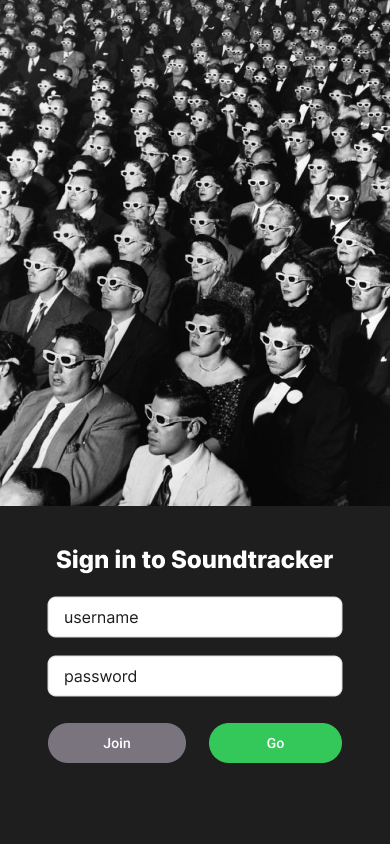
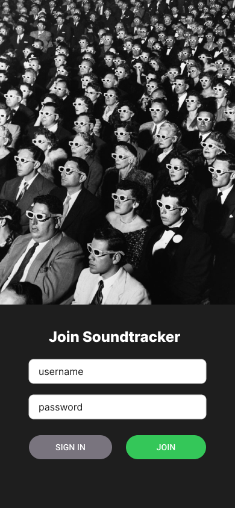
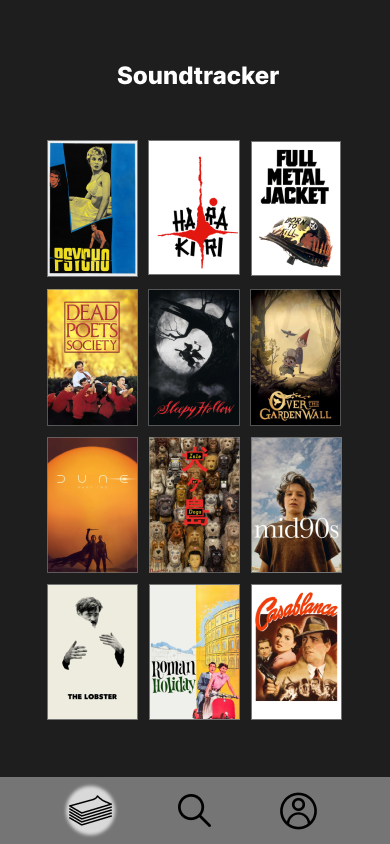
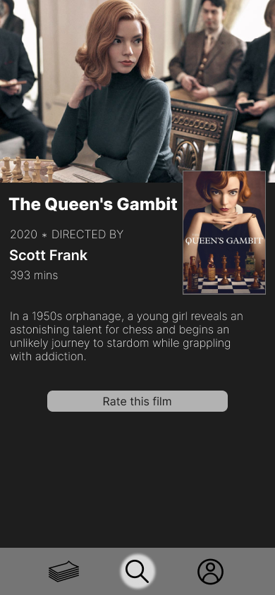
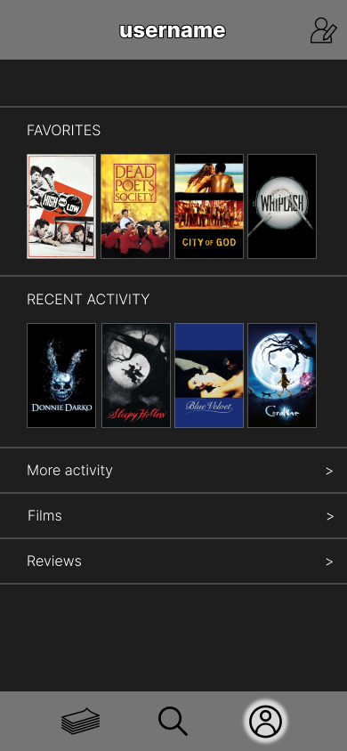

## **Soundtracker-Mobile**

**Soundtracker-Mobile** — это мобильный клиент, предназначенный для трекинга просмотренных фильмов. Пользователи могут добавлять фильмы в свою коллекцию, оставлять отзывы и управлять профилем. Приложение взаимодействует с сервером, разработанным на Java (Spring).

---

## Документация

Более детальная информация по требованиям к проекту доступна в [документации](./srs.md).

---

## **Функциональные возможности**
* Авторизация и регистрация пользователей.
* Просмотр коллекции фильмов.
* Возможность отметить фильм как просмотренный.
* Добавление и редактирование отзывов к фильмам.
* Управление профилем пользователя: изменение личной информации и просмотр списка просмотренных фильмов.

---

## **Технологии**

**Язык разработки мобильного приложения**: Kotlin  
**Среда разработки**: Android Studio  
**Бэкенд**: Java (Spring)  
**База данных**: PostgreSQL  
**Сторонние API**: Kinopoisk API (для получения данных о фильмах)

---

## **Мокапы приложения**

### Страница авторизации

### Страница регистрации

### Главная страница со списком фильмов

### Страница фильма

### Профиль пользователя

[//]: # (### Страница просмотренных фильмов)

[//]: # (![Просмотренные фильмы]&#40;./mockups/watched_movies.png&#41;)