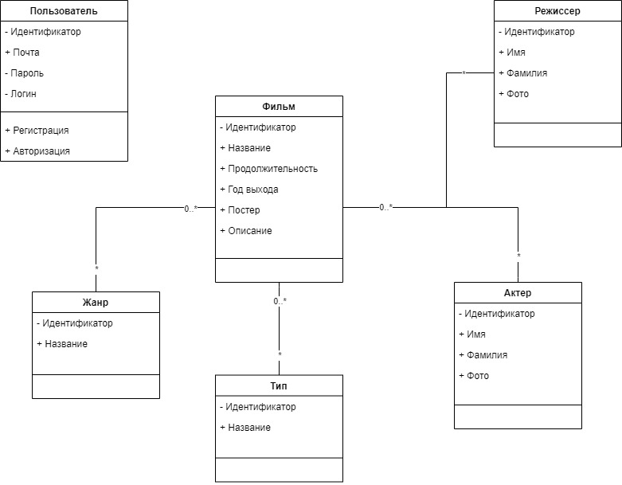

# Диаграмма классов

## Глоссарий

| Класс        | Описание                                                                                                                                                           |
|:-------------|:-------------------------------------------------------------------------------------------------------------------------------------------------------------------|
| Фильм        | Кино, которое имеет название, описание, жанр, постер, год выхода, продолжительность тип и может быть связано с актерами и режиссерами.                             |
| Жанр         | Категория, к которой относится фильм (например, комедия, драма, боевик и т.д.).                                                                                                                                                   |
| Тип          | Классификация кино по типу (например, полнометражный, короткометражный, сериал).                                                                                   |
| Актер        | Человек, который участвует в фильме, имеет уникальный идентификатор, имя и фото.                                                                                   |
| Режиссер     | Человек, который режиссирует фильм, имеет уникальный идентификатор, имя и фото.                                                                                    |
| Пользователь | Лицо, зарегистрированное в системе, которое может выполнять действия, такие как авторизация или регистрация. Имеет уникальный идентификатор, логин, пароль, почту. |