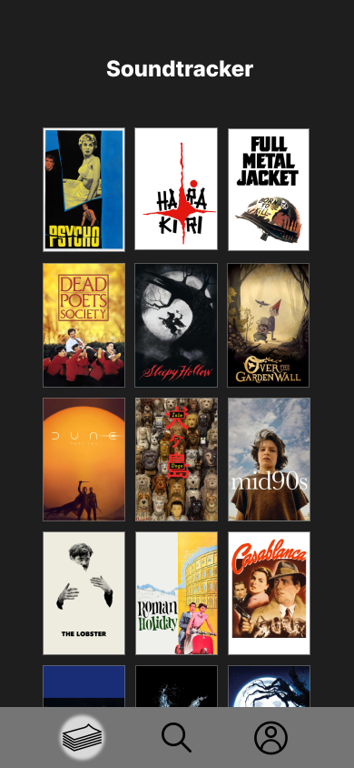
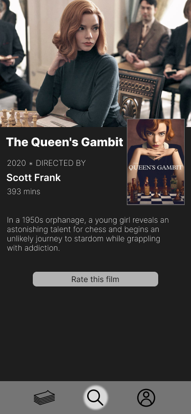
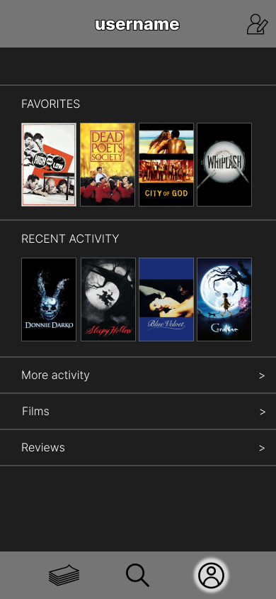

# Требования к проекту

---

# Содержание

### 1. [Введение](#1-введение)
### 2. [Требования пользователя](#2-требования-пользователя)
### 3. [Системные требования](#3-системные-требования)

---
## 1. Введение

---
В данном проекте разрабатывается мобильное приложение под названием **Soundtracker-Mobile** — это мобильное приложение, которое позволяет пользователям отслеживать просмотренные фильмы, оставлять отзывы и управлять личной информацией. Приложение будет взаимодействовать с серверной частью, реализованной на Java Spring. Основные функции: авторизация, регистрация, просмотр фильмов, добавление отзывов и управление профилем. Приложение **не** будет предоставлять возможность просмотра фильмов, а только управлять информацией о просмотре.
### Границы

| № | Описание                                    | Потребности бизнеса (MoSCoW) |
|---|---------------------------------------------|------------------------------|
| 1 | Поиск фильмов по названию                   | Must have                    |
| 2 | Поиск фильмов по ID                         | Must have                    |
| 3 | Просмотр информации о фильме                | Must have                    |
| 4 | Добавление фильма в список просмотренных    | Should have                  |
| 5 | Добавление и редактирование отзыва к фильму | Should have                  |
| 6 | Редактирование профиля пользователя         | Should have                  |
| 7 | Просмотр списка просмотренных фильмов       | Should have                  |

## 2. Требования пользователя

---
### 2.1 Программные интерфейсы
Приложение взаимодействует с:
- **Бэкенд-сервисом Soundtracker**, разработанным на Java Spring для работы с фильмами и профилями пользователей.
- **Kinopoisk API** для получения данных о фильмах.
- **Spring Security**, **JSON Web Token** для авторизации и аутентификации.
- Базой данных **PostgreSQL** для хранения информации о пользователях и фильмах.

### 2.2 Интерфейс пользователя

| Функциональное требование | Описание                                                                                               |
|---------------------------|--------------------------------------------------------------------------------------------------------|
| Страница авторизации      | Вход в существующий аккаунт или переход к регистрации                                                  |
| Страница регистрации      | Создание нового аккаунта пользователя                                                                  |
| Главная страница          | Список фильмов с возможностью поиска и выбора                                                          |
| Страница фильма           | Подробная информация о фильме с возможностью отметить как фильм просмотренный и добавить на него отзыв |
| Профиль пользователя      | Информация о пользователе с возможностью просмотра списка любимых и просмотренных фильмов    | 

## **Мокапы приложения**

### Страница авторизации

### Страница регистрации

### Главная страница со списком фильмов

### Страница фильма

### Профиль пользователя

[//]: # (### Страница просмотренных фильмов)

[//]: # (![Просмотренные фильмы]&#40;./mockups/watched_movies.png&#41;)

### 2.3 Характеристики пользователей

| Группа пользователей | Уровень образования                        | Техническая грамотность | Опыт                                                                                                   | Потребности и ожидания                                                                                                                                            |
|----------------------|--------------------------------------------|-------------------------|--------------------------------------------------------------------------------------------------------|-------------------------------------------------------------------------------------------------------------------------------------------------------------------|
| Обычные зрители      | Среднее или высшее                         | Низкая                  | Малый опыт. Смотрят фильмы по рекомендациям знакомых или популярных платформ.                          | Ищут простой и интуитивный интерфейс, возможность быстрого поиска и получения рекомендаций без сложностей.                                                        |
| Молодежь и студенты  | Учащиеся (школы, университеты, колледжи)   | Средняя                 | Имеют опыт использования стриминговых сервисов, активно следят за новинками.                           | Ожидают актуальный и разнообразный контент, интересный функционал.                                                                                                |
| Киноманы             | Любой                                      | Высокая                 | Имеют значительный опыт. Знакомы с различными жанрами и стилями. Оставляют большое количество отзывов. | Ожидают наличие широкого каталога, возможность написания отзывов, добавления фильмов в список просмотренных. Также ожидают большого числа активных пользователей. |
| Специалисты по кино  | Высшее в области искусства                 | Высокий                 | Значительный опыт анализа и критики, часто изучают разные аспекты кинематографа.                       | Ожидают глубокого контента, расширенных функций для поиска и анализа, возможность сортировки по разным критериям.                                                 |

### 2.4 Предположения и зависимости

  **Предположения**:
1. Пользователи имеют доступ к сети Интернет.
2. База данных будет регулярно обновляться новыми фильмами, чтобы поддерживать интерес пользователей и актуальность контента.
3. Ожидается, что пользователи знакомы с основами работы мобильных приложений на Android.

**Зависимости**:
1. Успех зависит от эффективной маркетинговой стратегии, направленной на привлечение новой аудитории.
2. Необходимы квалифицированные сотрудники для дальнейшего развития и поддержки платформы.
3. Приложение зависит от стабильности работы бэкенд-сервера для авторизации и доступа к фильмам.

## 3. Системные требования

### 3.1 Функциональные требования

| Функциональное требование                    | Описание                                                                                 |
|----------------------------------------------|------------------------------------------------------------------------------------------|
| Авторизация и регистрация                    | Система должна позволять пользователям войти в свой аккаунт или же создать новый         |
| Просмотр коллекции фильмов                   | Система должна предоставлять актуальныый список фильмов                                  |
| Просмотр информации о фильме                 | Пользователь может просмотреть основную информацию о фильме                              |
| Добавление фильма в список просмотренных     | Пользователь может добавить фильм в список просмотренных                                 |
| Добавление и редактирование отзыва к фильму  | Пользователь может добавить отзыв к фильму или отредактировать его                       |
| Управление профилем пользователя             | Система должна предоставлять пользователям возможность редактирования личной информации

### 3.2 Нефункциональные требования

- **NFR-1**: Среднее время безотказной работы (MTBF) должно составлять не менее 93%.
- **NFR-2**: Должна быть реализована защита данных, включая шифрование и соответствие минимальным стандартам безопасности.
- **NFR-3**: Время отклика на запросы поиска должно составлять не более 3 секунд.
- **NFR-4**: Среднее время обучения пользователя должно быть не более 8 минут.
